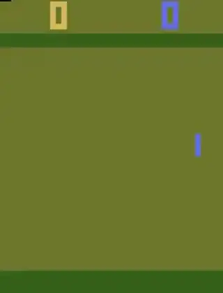

# Pong-DQN
A Deep Q-Network (DQN) implementation that learns to play Pong from Atari using reinforcement learning (RL).
The current implementation features a CNN flattened into a FC network with an Agent that uses Experience Buffers.
A Target Network and a Training Network is used for stability.

The training phase captures videos and saves model parameters along with TensorBoard diagrams.

## 📈 Training Progress Visualization (DQN)

Below are clips showing the agent's behavior at different training stages. The model was trained using DQN on PongNoFrameskip-v4. You can observe the improvement in strategy and reaction time over time.

| Episode | Agent Behavior                                     |
|---------|----------------------------------------------------|
| 0       |  |
| 200     |       |
| 400     |       |

## Installation and Usage
```bash
git clone https://github.com/Arsalanjdev/PongDQN
cd PongDQN
pip install -r requirements.txt
```
Then cd into a directory of choice and run train.py inside the directory of the chosen implementation. 


## TODO
- Add support for Double DQN
- Add reward shaping options

